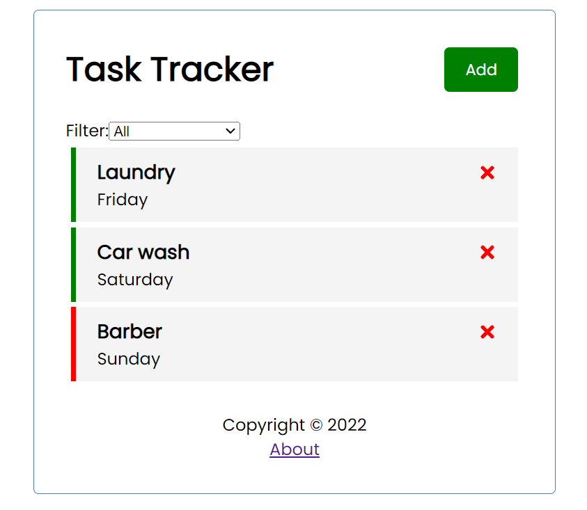
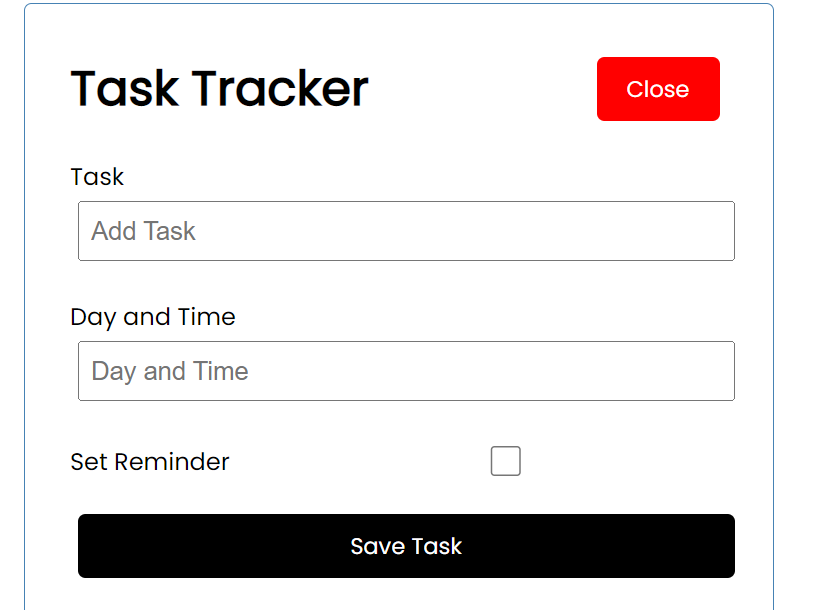
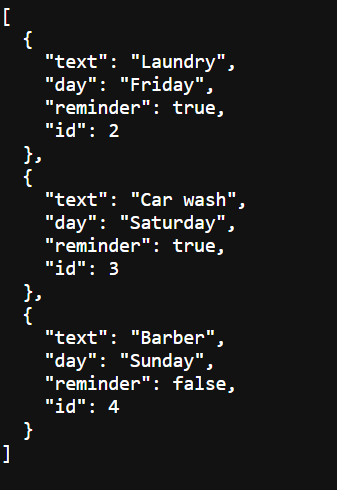

# Task Tracking Application using ReactJS

This Task tracking app was developed as I learn ReactJS and all its basic components!
It exhausts the power of ReactJs in terms of data state management with a mock json backend as a server which is unfortunately not hosted globally.

# User Interface preview

## Home Page
 

 

## Adding Task functionality
 

 

## Mock json DB
 

