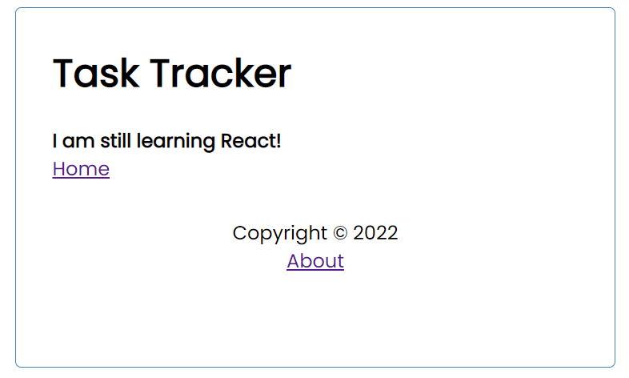

# Task Tracking Application using ReactJS

This Task tracking app was developed as I learn ReactJS and all its basic components!
It exhausts the power of ReactJs in terms of data state management with a mock json backend as a server which is unfortunately not hosted globally.

You can find this app at <a href="https://ernestmalcolm-task-app.vercel.app">Task Tracker App</a>
The mock back-end and server is unfortunately not live hence the empty task list in the live app.

# User Interface preview

## Home Page
 

 

## Adding Task functionality
 

 

## About page using React Route V6
 

## Mock json DB
 

